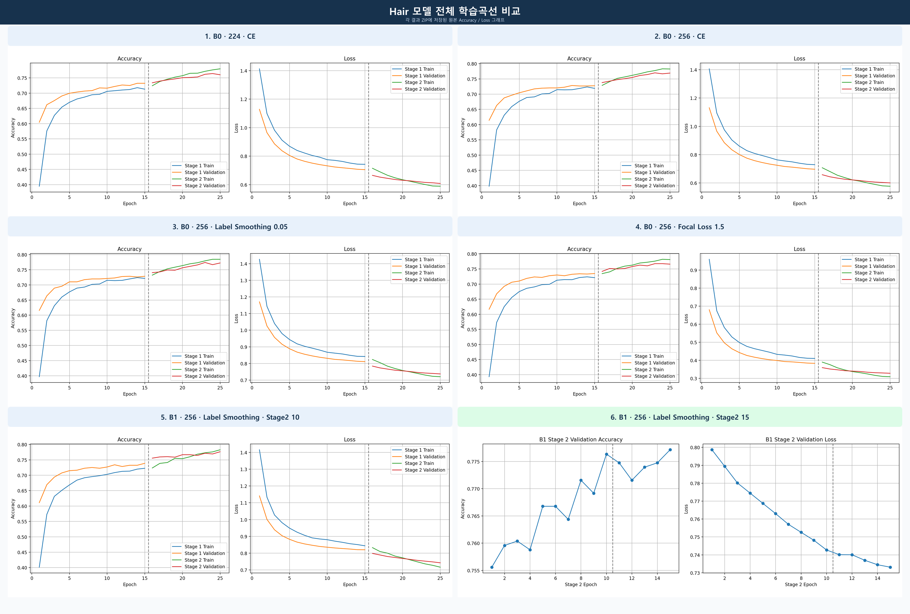
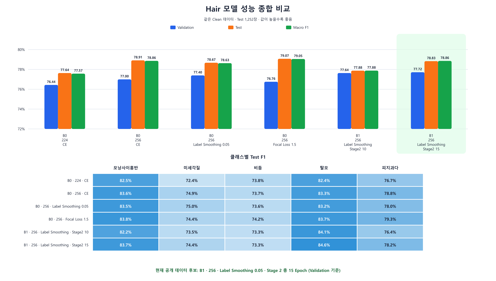

# Hair 두피 분류 모델 실험 총정리

- 정리일: 2026-09-07
- 대상: USB 현미경 기반 두피 상태 5-class 분류
- 현재 상태: 공개 데이터 기준 후보 모델 선정 완료, 실제 USB 현미경 검증 전

## 1. 오늘 작업의 목적

기존 Hair 모델의 성능이 충분하지 않은 원인을 확인하고, 평가를 믿을 수 있는 데이터셋을 다시 만든 뒤 학습 방법을 단계적으로 개선하는 것이 목적이었다.

오늘의 전체 흐름은 다음과 같다.

```text
기존 데이터와 모델 확인
        ↓
Train / Validation / Test 중복 검사
        ↓
분할 간 완전 동일 이미지 발견
        ↓
기존 증강본 폐기 및 원본 기준 데이터 재구성
        ↓
Clean 224 Partial Fine-tuning
        ↓
256 해상도 비교
        ↓
오답 분석
        ↓
Label Smoothing 비교
        ↓
Focal Loss 비교
        ↓
EfficientNet-B1 비교
        ↓
B1 Stage 2를 5 Epoch 추가학습
        ↓
공개 데이터 기준 후보 선정 및 결과 시각화
```

## 2. 분류 대상과 모델의 역할

Hair 모델은 일반 얼굴 사진을 처리하는 Web Skin 모델과 별개다. USB 현미경으로 촬영한 두피 확대 이미지에서 다음 5개 상태를 구분한다.

1. 모낭사이홍반
2. 미세각질
3. 비듬
4. 탈모
5. 피지과다

현재 데이터에는 정상 두피 클래스가 없다. 따라서 이 모델은 입력된 사진을 위 5개 중 하나로 분류하며, 정상 여부를 판단하는 모델로 해석하면 안 된다.

## 3. 기존 데이터에서 발견한 문제

### 3.1 검사 방법

파일명만 비교하지 않고 각 파일 내용의 SHA-256 값을 계산했다. SHA-256이 같다는 것은 이름이나 저장 위치가 달라도 파일 내용이 완전히 같다는 뜻이다.

### 3.2 검사 결과

기존 `hair_processed`의 Original 분할에서 다음 중복이 발견되었다.

| 비교한 분할 | 완전 동일 파일 수 |
|---|---:|
| Train ↔ Validation | 195 |
| Train ↔ Test | 178 |
| Validation ↔ Test | 16 |

일부 완전 동일 파일은 서로 다른 클래스 라벨에 들어가 있었다. 이 상태로 학습하면 모델이 Train에서 본 사진을 Validation이나 Test에서 다시 볼 수 있으므로 평가 결과가 실제 일반화 성능보다 높아질 수 있다. 반대로 같은 사진에 다른 답이 붙으면 학습 자체가 혼란스러워진다.

따라서 해당 데이터로 예정했던 학습을 중단하고 데이터 정리를 우선했다. 이 결정은 성능을 높이기 위한 조정이 아니라 평가의 신뢰성을 확보하기 위한 조치였다.

## 4. Clean 데이터셋 재구성

### 4.1 재구성 원칙

- 기존 증강본은 어느 원본에서 만들어졌는지 연결 기록이 없어서 재사용하지 않았다.
- Original 전체를 합친 뒤 파일 내용과 라벨을 다시 검사했다.
- 완전 동일 파일과 라벨 충돌을 정리했다.
- 각 클래스를 SHA-256과 고정 Seed 42에 따라 80:10:10으로 다시 분할했다.
- Train을 분할한 다음 Train 원본에서만 새 증강본을 만들었다.
- Validation과 Test에는 증강본을 넣지 않았다.
- 새 증강 이미지마다 출처 원본과 적용 변환을 기록했다.

### 4.2 Clean Original 수량

| 클래스 | Train | Validation | Test | 전체 |
|---|---:|---:|---:|---:|
| 모낭사이홍반 | 1,990 | 248 | 248 | 2,486 |
| 미세각질 | 2,050 | 256 | 256 | 2,562 |
| 비듬 | 1,929 | 241 | 241 | 2,411 |
| 탈모 | 1,965 | 245 | 245 | 2,455 |
| 피지과다 | 2,098 | 262 | 262 | 2,622 |
| 합계 | 10,032 | 1,252 | 1,252 | 12,536 |

기존 데이터는 14,500장이었고, 정리 후 서로 구분되는 사용 가능 원본은 12,536장이었다. 두 수의 차이는 1,964장이지만, 분할 간 겹침 수에는 세 분할에 함께 나타난 파일 등이 중복 집계될 수 있으므로 단순히 세 중복 수를 더해 제거 수라고 해석하지 않는다.

### 4.3 학습에 사용한 증강 구성

Clean 데이터의 `augmented` 구조는 이름과 달리 모든 사진이 증강본이라는 뜻이 아니다.

```text
augmented/train = 원본 10,032장 + 새 증강본 5,015장 = 15,047장
augmented/val   = 원본 1,252장
augmented/test  = 원본 1,252장
```

클래스별 Train 수량은 다음과 같다.

| 클래스 | Train 원본 | 새 증강본 포함 Train |
|---|---:|---:|
| 모낭사이홍반 | 1,990 | 2,985 |
| 미세각질 | 2,050 | 3,075 |
| 비듬 | 1,929 | 2,893 |
| 탈모 | 1,965 | 2,947 |
| 피지과다 | 2,098 | 3,147 |
| 합계 | 10,032 | 15,047 |

새 데이터 ZIP은 다음 위치에 저장했다.

```text
/content/drive/MyDrive/mediflow_datasets/hair_clean_v1_20260907_053616.zip
```

- ZIP 크기: 2.78 GB
- SHA-256: `2ac7260663cf69835ba50edb6ae8c7e7ac13be9c73b9f7ea24f60e0342e7e156`
- 검사 보고서: `/content/drive/MyDrive/mediflow_datasets/hair_clean_v1_20260907_053616_reports`

## 5. 공통 학습 방법

각 실험에서 비교하려는 변수 하나를 제외하고 다음 조건을 가능한 한 고정했다.

| 항목 | 설정 |
|---|---|
| 데이터 | 동일한 `hair_clean_v1` 분할 |
| 클래스 순서 | 모낭사이홍반, 미세각질, 비듬, 탈모, 피지과다 |
| Batch Size | 32 |
| Seed | 42 |
| 사전학습 | ImageNet |
| Stage 1 | Backbone 동결, 분류 Head 15 Epoch, Learning Rate 0.0001 |
| Stage 2 | 후반부 30개 Layer 해제, 최대 10 Epoch, Learning Rate 0.00001 |
| Batch Normalization | Stage 2에서도 동결 |
| 모델 선택 | Test가 아닌 Validation Accuracy 기준 |
| Test 사용 | 선택이 끝난 모델의 최종 평가에만 사용 |

EfficientNet 모델 내부에 `Rescaling(1/255)`이 포함되어 있으므로 입력은 float32 RGB 0–255 범위로 전달했고 외부에서 다시 `/255.0` 정규화를 추가하지 않았다.

### Stage 1과 Stage 2의 의미

- Stage 1에서는 ImageNet에서 배운 일반 이미지 특징을 그대로 두고 새 5-class 분류 부분만 학습한다.
- Stage 2에서는 EfficientNet 후반부 30개 Layer를 열고 낮은 학습률로 두피 이미지에 맞게 미세조정한다.
- 이 방식을 Partial Fine-tuning이라고 한다.

## 6. 실험별 변경 변수

| 순서 | 실험 | 고정한 조건 | 한 가지 주요 변경 |
|---:|---|---|---|
| 1 | Clean 224 two-stage | Clean 데이터, B0, Cross Entropy, 학습 단계 | 신뢰 가능한 첫 기준선 구축 |
| 2 | Clean 256 CE | 실험 1의 나머지 조건 | 입력 224×224 → 256×256 |
| 3 | B0 Label Smoothing 0.05 | 256, B0, 데이터, Epoch | Loss의 Label Smoothing 0 → 0.05 |
| 4 | B0 Focal gamma 1.5 | 256, B0, 데이터, Epoch | Cross Entropy → Focal Loss gamma 1.5 |
| 5 | B1 Label Smoothing 0.05 | 256, Label Smoothing, 데이터, Epoch | Backbone B0 → B1 |
| 6 | B1 Stage 2 연장 | B1 모델과 optimizer 상태 | Stage 2 최대 10 → 총 15 Epoch |

## 7. 전체 성능 결과

아래 값은 각 결과 파일에 기록된 값을 그대로 옮겼다.

| 실험 | Validation Accuracy | Test Accuracy | Macro F1 |
|---|---:|---:|---:|
| B0 · 224 · Cross Entropy | 0.7643769979476929 | 0.7763578274760383 | 0.7757408067550379 |
| B0 · 256 · Cross Entropy | 0.7699680328369141 | 0.7891373801916933 | 0.7886477230068456 |
| B0 · 256 · Label Smoothing 0.05 | 0.7739616632461548 | 0.786741214057508 | 0.7863134458429594 |
| B0 · 256 · Focal gamma 1.5 | 0.7675718665122986 | 0.7907348242811502 | 0.7905122039602036 |
| B1 · 256 · Label Smoothing · Stage 2 10 Epoch | 0.7763578295707703 | 0.7787539936102237 | 0.778812327205678 |
| B1 · 256 · Label Smoothing · Stage 2 15 Epoch | 0.7771565318107605 | 0.7883386581469649 | 0.7885764577048346 |

### 7.1 224와 256 비교

256 실험은 224 실험보다 Validation Accuracy, Test Accuracy, Macro F1이 모두 높았다. 두피에서는 미세각질, 비듬, 피지처럼 작은 질감이 중요하므로 해상도를 높여 세부 정보가 더 보존된 것이 성능 차이에 영향을 주었을 가능성이 있다. 다만 이 해석은 결과에 근거한 가설이며, 특정 픽셀 영역의 기여도를 직접 측정한 결과는 아니다.

### 7.2 Label Smoothing 0.05

Label Smoothing은 모델이 특정 클래스에 지나치게 확신하는 것을 줄이기 위한 방법이다.

- Validation Accuracy: 0.7739616632461548
- Test Accuracy: 0.786741214057508
- Macro F1: 0.7863134458429594
- 평균 최대 예측 확률: 0.7246817350387573

Cross Entropy 기준 모델의 오답 감사에서 `all_test_predictions.csv`의 1,252개 `top1_probability`를 다시 계산한 평균은 0.7702882248229874였다. Label Smoothing 모델은 예측 확률을 낮추는 방향으로 작동했지만, 최종 분류 성능 차이는 크지 않았다.

### 7.3 Focal Loss gamma 1.5

Focal Loss는 모델이 이미 쉽게 맞히는 표본보다 어려운 표본에 더 집중하도록 만든다.

- Validation Accuracy: 0.7675718665122986
- Test Accuracy: 0.7907348242811502
- Macro F1: 0.7905122039602036
- 평균 최대 예측 확률: 0.6707963347434998

6개 학습 결과 중 Test Accuracy와 Macro F1은 가장 높았다. 그러나 Validation Accuracy는 B1 후보보다 낮았다. Test 결과를 보고 모델을 선택하면 Test 세트에 맞춰 의사결정을 반복하는 문제가 생기므로 현재 후보로 선택하지 않았다. 향후 실제 장비 검증에서는 B1 후보와 함께 비교할 가치가 있는 대안 모델이다.

### 7.4 EfficientNet-B1

B1은 B0보다 큰 Backbone으로 더 많은 특징을 표현할 수 있지만 계산량과 모델 크기도 증가한다.

Stage 2 10 Epoch 결과:

- Validation Accuracy: 0.7763578295707703
- Test Accuracy: 0.7787539936102237
- Macro F1: 0.778812327205678
- 파라미터 수: 6,581,644
- 모델 파일 크기: 47,218,934 bytes

마지막 Epoch까지 Validation Loss가 감소하고 있었기 때문에 같은 optimizer 상태를 복원하여 Stage 2만 5 Epoch 연장했다.

Stage 2 총 15 Epoch 결과:

- Validation Accuracy: 0.7771565318107605
- Test Accuracy: 0.7883386581469649
- Macro F1: 0.7885764577048346
- 추가학습 최고 Epoch: Stage 2의 15번째 Epoch

연장 전보다 Validation Accuracy가 개선됐지만 증가 폭은 Validation 1,252장 중 정답 1장에 해당한다. 추가 5 Epoch 뒤에도 큰 폭의 개선이 나타난 것은 아니므로 같은 방식의 단순 연장은 여기서 중단했다.

## 8. 클래스별 F1 비교

| 실험 | 모낭사이홍반 | 미세각질 | 비듬 | 탈모 | 피지과다 |
|---|---:|---:|---:|---:|---:|
| B0 · 224 · CE | 0.8250950570342205 | 0.724 | 0.7383966244725738 | 0.8237704918032787 | 0.7674418604651163 |
| B0 · 256 · CE | 0.8362235067437379 | 0.7485148514851485 | 0.7372881355932204 | 0.8333333333333334 | 0.7878787878787878 |
| B0 · 256 · LS 0.05 | 0.8346153846153846 | 0.7495069033530573 | 0.7357293868921776 | 0.8316008316008316 | 0.780114722753346 |
| B0 · 256 · Focal 1.5 | 0.837573385518591 | 0.7436399217221135 | 0.7420042643923241 | 0.8368200836820083 | 0.7925233644859813 |
| B1 · Stage 2 10 | 0.821917808219178 | 0.7349397590361446 | 0.7329192546583851 | 0.8405797101449275 | 0.7637051039697542 |
| B1 · Stage 2 15 | 0.8373015873015873 | 0.744466800804829 | 0.7325102880658436 | 0.8463157894736842 | 0.7822878228782287 |

전반적으로 모낭사이홍반과 탈모는 상대적으로 높은 F1을 보였다. 미세각질과 비듬은 낮은 편이며, 특히 비듬 F1은 B1 추가학습 후에도 0.7325102880658436이었다. 모델 크기나 Epoch만 늘려서는 두 클래스의 시각적 경계를 충분히 해결하지 못했다.

## 9. 256 Cross Entropy 모델 오답 분석

별도 오답 감사 노트북으로 Test 1,252장을 다시 분석했다.

- 재현 Test Accuracy: 0.7899361022364217
- 재현 Macro F1: 0.7894288581149363
- 오답: 263장
- 중점 검토 오답: 105장
- 잘못 예측했지만 최대 확률이 0.7 이상인 사례: 94장
- 잘못 예측했지만 최대 확률이 0.9 이상인 사례: 21장

학습 결과 파일에 기록된 동일 계열 모델의 Test Accuracy 0.7891373801916933과 오답 감사의 재현값 0.7899361022364217은 정답 1장만큼 차이가 난다. 저장된 산출물만으로 차이의 원인을 단정하지 않으며 두 값은 각 결과물의 기록으로 구분해 보존한다.

주요 혼동은 다음과 같다.

| 실제 클래스 → 예측 클래스 | 오답 수 |
|---|---:|
| 비듬 → 미세각질 | 38 |
| 미세각질 → 비듬 | 31 |
| 비듬 → 피지과다 | 23 |
| 피지과다 → 비듬 | 13 |

오답 263장 중 위 네 혼동이 105장을 차지했다. 핵심 문제는 모든 클래스를 무작위로 틀리는 것이 아니라 미세각질·비듬·피지과다처럼 질감과 부착물이 유사한 클래스 사이에 오답이 집중된다는 점이다.

## 10. 현재 후보 모델 선정

현재 공개 데이터 기준 후보는 다음 모델이다.

```text
EfficientNet-B1
입력 256×256
Label Smoothing 0.05
Stage 1: 15 Epoch
Stage 2: 총 15 Epoch
후반부 30개 Layer 미세조정
```

선정 기준은 Validation Accuracy다. 후보의 Validation Accuracy 0.7771565318107605가 비교한 학습 결과 중 가장 높았다.

이 모델을 최종 의료 모델이라고 부르지는 않는다. 실제 USB 현미경과 실제 대상자를 사용한 독립 검증 데이터가 없기 때문이다. 현재 표현은 **공개 데이터 기준 후보 모델**이 정확하다.

Focal 모델은 Test Accuracy와 Macro F1이 가장 높으므로 폐기하지 않는다. 실제 장비 데이터가 확보되면 B1 후보와 Focal 대안 모델을 같은 데이터에서 비교한다.

## 11. 현재 결과의 한계

### 11.1 실제 장비 Domain Gap 미검증

공개 데이터와 실제 USB 현미경 사진은 조명, 센서, 배율, 초점, 색감과 촬영 거리가 다를 수 있다. 현재 Test 성능이 실제 장비에서도 유지된다고 말할 근거는 아직 없다.

### 11.2 사람·병변·촬영 세션 단위 분할 미검증

파일 내용이 완전히 같은 중복은 제거했지만 사람 ID, 병변 ID, 촬영 세션 정보가 없었다. 같은 사람이나 같은 부위의 유사 사진이 여러 분할에 들어갔는지는 확인하지 못했다.

### 11.3 다중 라벨 여부 미검증

Clean ZIP에는 원본 라벨 JSON이 포함되어 있지 않아 한 이미지에 여러 두피 상태가 동시에 기록됐는지 확인하지 못했다. 현실에서는 비듬과 피지과다가 동시에 나타날 수 있으므로 단일 5-class 분류 자체가 실제 상태를 단순화할 수 있다.

### 11.4 정상 클래스 부재

현재 모델은 정상과 질환을 구분하지 않는다. 입력이 정상 사진이어도 다섯 상태 중 하나를 출력한다.

### 11.5 Test 반복 확인

오늘 여러 실험의 Test 결과를 확인했다. 이후에는 Test 점수를 기준으로 설정을 계속 바꾸지 않고, Validation 또는 새 실제 장비 검증 세트로 모델을 선택해야 한다.

## 12. 오늘 만든 산출물

### Colab 노트북

| 파일 | 역할 | 실행 상태 |
|---|---|---|
| `hair_clean_dataset_builder_colab.ipynb` | 중복 정리와 Clean ZIP 생성 | 실행 완료 |
| `hair_clean_two_stage_training_colab.ipynb` | Clean 224 B0 two-stage | 실행 완료 |
| `hair_clean_256_training_colab.ipynb` | 224와 256 비교 | 실행 완료 |
| `hair_clean_256_error_audit_colab.ipynb` | 256 CE 오답 분석 | 실행 완료 |
| `hair_clean_256_label_smoothing_training_colab.ipynb` | Label Smoothing 0.05 비교 | 실행 완료 |
| `hair_clean_256_focal_loss_training_colab.ipynb` | Focal Loss gamma 1.5 비교 | 실행 완료 |
| `hair_clean_256_efficientnetb1_training_colab.ipynb` | B0와 B1 비교 | 실행 완료 |
| `hair_clean_256_efficientnetb1_extend5_colab.ipynb` | B1 Stage 2 5 Epoch 연장 | 실행 완료 |
| `hair_public_candidate_packaging_colab.ipynb` | 후보 모델·설정·모델 카드 ZIP 생성 | 생성 완료, 실행 전 |

### 비교 자료

- `results/hair/hair_experiment_comparison_20260907.xlsx`
- `results/hair/hair_all_training_curves_comparison_20260907.png`
- `results/hair/hair_model_performance_dashboard_20260907.png`





## 13. 발표에서 사용할 핵심 이야기

발표에서는 실험 횟수보다 문제를 발견하고 통제된 실험으로 해결한 과정을 강조한다.

> 기존 Hair 모델의 성능을 높이기 전에 평가 데이터의 신뢰성을 먼저 검사했다. 파일 내용 기반 검사에서 Train, Validation, Test 사이의 완전 동일 이미지를 발견했기 때문에 기존 평가를 그대로 신뢰하지 않고 원본부터 다시 정리했다. Clean 데이터에서는 Train에만 새 증강본을 추가하고 Validation과 Test는 원본으로 유지했다. 이후 Partial Fine-tuning을 기준으로 해상도, Loss, Backbone과 학습 Epoch를 한 번에 하나씩 변경했다. 256 해상도에서 성능이 개선됐고, Focal Loss는 Test와 Macro F1이 가장 높았으며, B1 추가학습 모델은 Validation이 가장 높았다. Test를 이용해 모델을 고르는 문제를 피하기 위해 B1을 공개 데이터 후보로 선택했다. 다만 실제 USB 현미경 데이터가 없으므로 최종 모델 확정은 실제 장비 검증 이후로 남겨 두었다.

## 14. 권장 PPT 구성

1. **프로젝트 목적** — USB 현미경 두피 5-class 분류
2. **기존 문제** — 성능 부족과 데이터 신뢰성 의문
3. **중복 검사 결과** — Train/Validation/Test 완전 동일 파일 수
4. **Clean 데이터 설계** — 80:10:10과 Train-only 증강
5. **학습 전략** — ImageNet, Stage 1, Partial Fine-tuning
6. **실험 설계** — 해상도, Loss, Backbone, Epoch를 한 번에 하나씩 변경
7. **전체 학습곡선** — `hair_all_training_curves_comparison_20260907.png`
8. **최종 성능 비교** — `hair_model_performance_dashboard_20260907.png`
9. **오답 분석** — 미세각질·비듬·피지과다 혼동
10. **후보 선정 근거** — Validation 기준 B1 선택, Focal은 대안 보존
11. **한계** — 실제 장비, 사람 단위 분할, 정상 클래스, 다중 라벨
12. **다음 단계** — 후보 패키징 후 실제 USB 현미경 검증

## 15. 보고서 권장 목차

1. 연구 배경과 목적
2. 두피 클래스 정의
3. 기존 데이터 문제와 중복 검사 방법
4. Clean 데이터셋 구축 방법
5. 데이터 증강과 분할 원칙
6. EfficientNet 및 Partial Fine-tuning 방법
7. 실험 변수와 공통 조건
8. 정량 결과
9. 클래스별 성능과 오답 분석
10. 후보 모델 선정 기준
11. 연구 한계
12. 실제 장비 검증 계획

## 16. 발표와 보고서에서 피해야 할 표현

| 피해야 할 표현 | 권장 표현 |
|---|---|
| 최종 의료 진단 모델을 완성했다 | 공개 데이터 기준 후보 모델을 선정했다 |
| 실제 환자에서도 정확도가 동일하다 | 실제 장비 데이터에서 추가 검증이 필요하다 |
| 데이터 누수를 완전히 제거했다 | 완전 동일 파일의 분할 간 중복을 제거했다 |
| B1이 모든 면에서 가장 좋다 | B1은 Validation이 가장 높고 Focal은 Test와 Macro F1이 가장 높다 |
| 증강본으로 성능을 평가했다 | Train에는 원본과 증강본을 사용하고 Validation/Test는 원본만 사용했다 |

## 17. 다음 실행 순서

1. `hair_public_candidate_packaging_colab.ipynb`를 Colab에서 실행해 B1 후보 모델과 모델 카드, 설정 파일을 한 ZIP으로 저장한다.
2. 실제 USB 현미경과 대상자 데이터가 확보되기 전까지 현재 후보를 최종 의료 모델로 확정하지 않는다.
3. 촬영 시 사람·부위·세션·장비·배율·조명·초점 정보를 함께 기록한다.
4. 실제 검증 세트에서 B1 후보와 Focal 대안 모델을 같은 조건으로 비교한다.
5. 공개 Test와 실제 장비 결과의 차이를 Domain Gap으로 분석한다.
6. 그 결과를 기준으로 증강, 해상도 또는 모델을 다시 조정하고 최종 모델 카드를 확정한다.

## 18. 한 문장 결론

오늘 작업은 기존 모델을 단순히 반복 학습한 것이 아니라, **데이터 중복으로 인한 평가 위험을 발견해 Clean 데이터셋을 다시 만들고, 동일 조건에서 해상도·Loss·Backbone·Epoch를 단계적으로 비교하여 EfficientNet-B1 추가학습 모델을 공개 데이터 기준 후보로 선정한 과정**이다.
