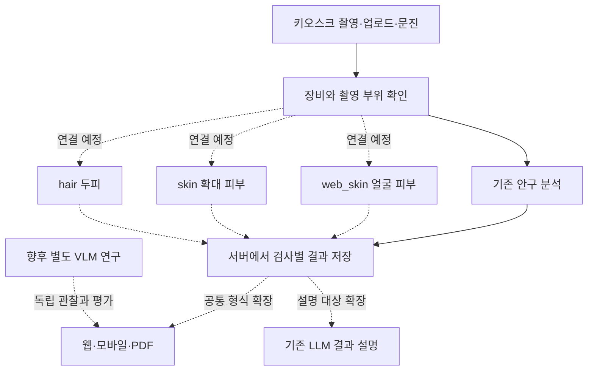

# MediFlow Kiosk 저장소 분석과 피부·두피 AI 연결 계획

작성일: 2026-09-13

이 문서는 팀원의 웹·안구·LLM 저장소와 현재 로컬의 Hair, Web Skin, Skin 후보를 대조한 분석이다. **웹과 LLM의 기반은 재사용할 수 있지만, 세 후보 모델이 키오스크에 연결된 상태는 아니다.** 다음 작업의 중심은 재학습보다 모델별 입력·출력 연결과 검증이다.

## 1. 무엇을 기준으로 확인했는가

- 대상: [Phjrab/mediflow-kiosk-core](https://github.com/Phjrab/mediflow-kiosk-core).
- 브라우저에서 확인한 `main` 최신 커밋: [2877e65f99bb1a3f9837b56c0736de57a4f66902](https://github.com/Phjrab/mediflow-kiosk-core/commit/2877e65f99bb1a3f9837b56c0736de57a4f66902), 표시 일시 2026-09-01 12:56 KST. 이후 분석은 이 버전의 파일을 기준으로 했다.
- 검색 도구에 남아 있던 과거 README와 실제 브라우저의 README가 달랐다. 최신 브라우저와 커밋 고정 소스를 우선했다.
- 웹 서버, 모델 로더, Jetson/RPi 추론, 검사 설정, 촬영·결과·요약 화면, 채팅 스크립트와 프롬프트, DB 스키마·접근 코드, 배포 사전점검, 관련 테스트를 읽었다.
- 로컬에서는 연구 배경·로드맵·세 도메인의 결과 정리, 후보 목록, 전처리 설정, 기존 추론 코드와 모델 사용 안내를 대조했다.
- **이번에 직접 확인:** 세 후보 `.keras` 파일 존재 및 SHA-256이 `CANDIDATE_INDEX.json`과 모두 일치한다.
- **이번에 실행하지 않은 것:** 원격 서버, 실제 카메라, Jetson 추론, LLM API, 카카오 전송, 원격 저장소 테스트. 따라서 코드 존재와 실제 장비 동작 성공을 구분한다. 웹에서 읽은 소스는 실행 가능한 체크아웃으로 확보한 것이 아니며, 저장소 전체의 완전한 보안 감사도 아니다.

분석만 수행했으며 팀원 GitHub, Drive, 기존 모델·평가 파일·노트북·사용 안내는 변경하지 않았다. 아래 연결 방식과 수정 항목은 제안이다.

## 2. 현재 두 프로젝트의 관계

| 영역 | 우리 로컬 프로젝트 | 팀원 키오스크 | 연결 후 역할 |
|---|---|---|---|
| 데이터·학습 | 데이터 감사·정제, Colab 학습, 실험 비교, 후보 패키징 | 이번 분석 범위에서 세 피부·두피 모델의 학습 결과는 확인되지 않음 | 학습 결과의 기준은 우리 후보 패키지 |
| 안구 | 우리 세 후보와 별개 | MediaPipe 눈 검출, PyTorch 분류, Grad-CAM, 픽셀 분석 코드 | 기존 안구 경로 유지 |
| 얼굴 피부 | `web_skin`, 5개 클래스 | `skin`이라는 이름의 웹캠 촬영 화면, 모델 미연결 | 이름 대응과 새 모델 실행 경로 필요 |
| 확대 피부 | `skin`, 10개 클래스 | 독립된 검사 항목 없음 | 현미경 피부 항목 추가 필요 |
| 확대 두피 | `hair`, 5개 클래스 | `scalp` 화면, 모델 미연결 | `scalp`와 `hair` 대응 필요 |
| 결과 설명 | 모델별 사용 조건·제한 기록 | 외부 LLM 채팅 코드 | 검증된 결과 JSON을 설명하도록 확장 |
| 장비·서비스 | 실제 장비 검증 미완료 | USB 카메라, 웹, DB, PDF, 서비스 관리 코드 | 팀원이 실제 장비에서 통합 검증 |

팀원 저장소의 검사 준비 상태는 설정 파일에서 안구만 `ready`, 피부·두피는 `not_configured`다. 피부·두피 클래스도 실제 질환명이 아닌 `ex1`, `ex2`다. 설정에서 `ready`만 바꾸면 모델이 생기거나 호출되는 구조는 아니다. [검사 설정](https://github.com/Phjrab/mediflow-kiosk-core/blob/2877e65f99bb1a3f9837b56c0736de57a4f66902/config/screening_modalities.json)

## 3. 지금까지 우리 쪽에서 완료한 일

| 도메인 | 완료한 연구 과정 | 현재 후보 | 아직 완료하지 않은 것 |
|---|---|---|---|
| Hair | 분할 간 중복 발견 → 정제·재분할 → 224/256 → 부분 미세조정 → LS/Focal → B0/B1 → B1 추가 5 epoch → 패키징 | B1 / 256 / LS 0.05 / 연장 학습 후보 | 실제 현미경 검증, 안정적인 개선의 반복 실험, 정상·범위 밖 입력 처리 |
| Web Skin | 데이터 감사 → 기존 분할 유지 → 6개 실험 묶음 → Validation 기준 선택 → 선정 후보 Test 평가 → 패키징 | B0 / 256 / CE | 실제 웹캠 검증, 낮은 품질·범위 밖 얼굴 입력 처리 |
| Skin | 동일 픽셀 중복 발견 → 원본 정제·재분할·증강 재생성 → Original/Augmented 비교 → 선정 후보 Test 평가 → 패키징 | B0 / 224 / CE / Augmented | 실제 현미경 검증, 정상·범위 밖 입력 처리 |

Skin은 분류부만 15 epoch 학습한 원본·증강 비교다. Hair/Web Skin처럼 부분 미세조정·256·6개 실험을 모두 수행했다고 쓰면 안 된다. 데이터 정제가 필요했기 때문에 기존 고득점 모델을 그대로 패키징한 것도 아니다.

Hair에서는 여러 실험의 Test가 이미 확인된 이력이 있다. 이후 개선을 계속할 경우 그 Test를 완전히 새로운 최종 검증 세트처럼 설명하지 않는다. Web Skin·Skin 문서에는 선정 후보를 고정한 뒤 Test를 평가한 절차가 기록되어 있다.

| 후보 | Validation Accuracy | Test Accuracy | Test Macro F1 |
|---|---:|---:|---:|
| Hair | 0.7771565318107605 | 0.7883386581469649 | 0.7885764577048346 |
| Web Skin | 0.796 | 0.8825 | 0.8813822927981046 |
| Skin | 0.982 | 0.9871428571428571 | 0.9871314132317626 |

위 값은 [후보 목록](../../results/CANDIDATE_INDEX.json)의 **기존 보고값**이며 이번에 정확도를 재측정한 값이 아니다. 서로 다른 데이터·클래스·분할의 점수이므로 세 모델의 우열 순위로 해석하지 않는다. 동일 이미지 검사를 통과했더라도 사람·병변·촬영 세션 단위 분리, 근접 중복, 라벨의 임상적 정확성까지 모두 검증된 것은 아니다.

세부 연구 기록: [Hair](HAIR_EXPERIMENT_SUMMARY_20260907.md), [Web Skin](WEB_SKIN_FULL_SUMMARY_20260908.md), [Skin](SKIN_FULL_SUMMARY_20260909.md).

## 4. 팀원 코드에서 실제로 확인한 기능

### 4.1 안구 분석

운영 웹 서버는 `eye_server.py`다. `/analyze`는 이미지 입력을 받아 안구 분석·가이드·이력 저장으로 연결한다. `server.py`는 `/health`, `/predict`를 제공하는 별도 최소 서버이므로 전체 키오스크의 대체 실행 파일로 혼동하면 안 된다. [운영 서버](https://github.com/Phjrab/mediflow-kiosk-core/blob/2877e65f99bb1a3f9837b56c0736de57a4f66902/eye_server.py), [최소 서버](https://github.com/Phjrab/mediflow-kiosk-core/blob/2877e65f99bb1a3f9837b56c0736de57a4f66902/server.py)

안구 분류기는 PyTorch EfficientNet-B0를 만들고 `.pth` 가중치를 엄격하게 읽는다. 입력은 BGR→RGB, 224 크기 조정, 채널 순서 변경, `/255`, ImageNet 평균·표준편차 정규화다. Grad-CAM은 모델 내부 특징에 기울기를 적용하는 PyTorch 구현이다. 주석에 적힌 정확도 99.09%는 이번에 재현한 평가 결과가 아니다. [분류기](https://github.com/Phjrab/mediflow-kiosk-core/blob/2877e65f99bb1a3f9837b56c0736de57a4f66902/modules/classifier.py)

현재 안구 클래스 순서는 결막염, 다래끼, 백내장, 일반/정상, 포도막염이다. 우리 세 모델의 클래스 순서와 공유하면 안 된다. [설정](https://github.com/Phjrab/mediflow-kiosk-core/blob/2877e65f99bb1a3f9837b56c0736de57a4f66902/config.py)

### 4.2 피부·두피 화면

촬영 화면은 USB 카메라 프레임 또는 업로드 이미지를 받아 브라우저의 `sessionStorage`에 저장한다. 다음 화면은 사진과 클래스별 `--`를 보여주고 촬영 단계를 완료 처리한다. 이 경로에서 피부·두피 추론 요청은 확인되지 않았다. 업로드는 최대 변 1280으로 축소한 후 JPEG 품질 0.84로 재인코딩하므로 학습 평가 파일과 동일한 이미지 바이트가 유지되지 않는다. [촬영 코드](https://github.com/Phjrab/mediflow-kiosk-core/blob/2877e65f99bb1a3f9837b56c0736de57a4f66902/web/templates/screening_capture.html), [결과 코드](https://github.com/Phjrab/mediflow-kiosk-core/blob/2877e65f99bb1a3f9837b56c0736de57a4f66902/web/templates/screening_result.html)

검사 진행 코드는 `eye`, `skin`, `scalp` 세 ID를 고정해서 사용한다. 새 항목은 JSON만 추가해서 끝나지 않는다. 통합 요약도 피부·두피를 ‘촬영 완료’로 표시한다. [검사 흐름](https://github.com/Phjrab/mediflow-kiosk-core/blob/2877e65f99bb1a3f9837b56c0736de57a4f66902/web/static/js/screening-flow.js), [통합 요약](https://github.com/Phjrab/mediflow-kiosk-core/blob/2877e65f99bb1a3f9837b56c0736de57a4f66902/web/templates/screening_summary.html)

### 4.3 LLM과 VLM의 현재 상태

LLM은 문장을 읽고 답하는 모델, VLM은 이미지와 문장을 함께 입력받는 모델이다. 현재 채팅은 분류 결과 JSON과 사용자 질문을 외부 서비스에 전달하는 **텍스트 LLM 연결**이다. 사진·영상 입력을 모델의 이미지 입력으로 보내는 VLM 경로는 확인한 운영 채팅에 없다.

프롬프트는 결과에 없는 수치를 만들지 않기, 미연결 검사 판독 금지, 점수와 의학적 위험도 구분, 히트맵을 확진 근거로 사용하지 않기 등을 명시한다. 그대로 유지할 만한 기반이다. 다만 문구가 존재한다는 사실이 실제 응답의 안전성 평가를 통과했다는 뜻은 아니다. [역할 프롬프트](https://github.com/Phjrab/mediflow-kiosk-core/blob/2877e65f99bb1a3f9837b56c0736de57a4f66902/config/llm_chat_role.txt)

`utils/chat_prompt.py`는 설정과 결과를 구분해서 넣고 길이를 제한하며 구분자 이탈을 막는다. 그러나 `ready` 모델에만 클래스 목록을 넣는 기능과, 클라이언트가 준 검사 결과가 진짜인지 검증하는 기능은 다르다. 결과 자체를 서버의 원본 기록과 대조하는 절차는 확인되지 않았다. [프롬프트 생성기](https://github.com/Phjrab/mediflow-kiosk-core/blob/2877e65f99bb1a3f9837b56c0736de57a4f66902/utils/chat_prompt.py)

채팅 UI는 `bilateral_analysis`, `eye_analysis_L/R`만 읽는다. 피부·두피 결과 추가, 새 결과 페이지에서의 표시, 검사별 설명 대상 선택이 필요하다. 이전 대화 전체를 서버에 보내지 않아 대화창이 있어도 다중 턴 기억이 구현되었다고 볼 수 없다. 채팅을 열 때 실제 `/api/chat`에 `test`를 보내며, API 실패 시 고정 안내로 바뀌는 것도 확인했다. 상태 확인용 별도 경로와 응답 출처 표시가 적절하다. [채팅 UI](https://github.com/Phjrab/mediflow-kiosk-core/blob/2877e65f99bb1a3f9837b56c0736de57a4f66902/web/static/js/chat-widget.js)

현재 확인한 채팅 경로에는 의료 문헌 검색·인용을 붙이는 RAG나 LLM 자체 학습 코드도 없다. 외부 모델 API 연결, 자체 LLM 학습, 의료 VLM 구현을 발표에서 분리해서 설명해야 한다.

### 4.4 기록·장비·테스트

DB는 사용자, 검사 세션, 이미지 자산, 문진, 이벤트 테이블이 분리되어 있다. `ai_reading_json`에 구조화 결과를 저장할 여지는 있지만, 네 모델의 실제 저장·조회·보고서 연결까지 자동으로 완성된 것은 아니다. `fhir_bundle_json` 컬럼 존재만으로 의료정보 표준 연동을 검증했다고 할 수도 없다. [스키마](https://github.com/Phjrab/mediflow-kiosk-core/blob/2877e65f99bb1a3f9837b56c0736de57a4f66902/database/schema.sql), [DB 코드](https://github.com/Phjrab/mediflow-kiosk-core/blob/2877e65f99bb1a3f9837b56c0736de57a4f66902/database/db.py)

Jetson 사전점검은 CUDA 연산, 체크포인트, 가상 분류·Grad-CAM, MediaPipe, 임시 DB, 실제 USB 프레임 등을 검사한다. LLM·카카오는 설정 존재만 검사하고 외부 호출은 하지 않는다. `--allow-no-camera` 통과는 카메라 검증 통과가 아니다. [사전점검](https://github.com/Phjrab/mediflow-kiosk-core/blob/2877e65f99bb1a3f9837b56c0736de57a4f66902/scripts/jetson_preflight.py)

테스트 폴더에는 분류기 로딩, 장치 선택, DB, 카메라, 서비스 제어, 검사 설정, 채팅 프롬프트 등의 테스트가 있다. 읽은 채팅 테스트는 프롬프트 구조·제약 문구를 검사하며 실제 LLM 응답 품질을 측정하지 않는다. 검사 설정 테스트는 피부·두피 미연결 상태를 기대하므로 모델 연결 시 테스트도 함께 바꿔야 한다. [채팅 테스트](https://github.com/Phjrab/mediflow-kiosk-core/blob/2877e65f99bb1a3f9837b56c0736de57a4f66902/tests/test_chat_prompt.py), [검사 설정 테스트](https://github.com/Phjrab/mediflow-kiosk-core/blob/2877e65f99bb1a3f9837b56c0736de57a4f66902/tests/test_screening_config.py)

## 5. 연결 전 해결할 핵심 항목

| 우선순위 | 확인된 차이·문제 | 연결 시 필요한 조치 |
|---|---|---|
| 먼저 | 키오스크 `skin`은 웹캠, 우리 `skin`은 현미경 | 장비+부위+모델 ID 대응표 고정 |
| 먼저 | `.pth` 로더와 `.keras` 후보 형식 차이 | Keras 실행 어댑터 또는 별도 추론 서비스 마련 |
| 먼저 | 안구는 외부 정규화, 세 후보는 내부 정규화 | 모델별 전처리 분리. 후보 입력에 `/255`와 안구 mean/std 적용 금지 |
| 먼저 | 후보별 224/256, B0/B1, 출력 5/10 차이 | 후보 메타데이터로 입력·출력·클래스 검사 |
| 먼저 | 피부·두피 화면은 사진 확인 단계 | 실제 추론 요청, 성공·실패 상태, 결과 저장과 표시 추가 |
| 먼저 | 채팅이 안구 결과만 수집 | 네 모델을 구분하는 서버 검증 결과 연결 |
| 먼저 | 모델 점수와 위험도가 혼합된 가이드 규칙 | 점수·증상·진료 안내를 별도 정보로 분리 |
| 연결 전 | 우리 `MODEL_USAGE.md`와 전처리 계약 불일치 | 안내 예제를 학습 경로와 대조해 정정 후 전달 |
| 연결 전 | 로컬 공통 추론 코드가 과거 모델 경로 사용 | 새 후보 레지스트리 적용 여부 확인. 현재 CLI가 새 후보를 사용한다고 가정 금지 |
| 배포 전 | 이력 API·정적 이미지·보고서의 접근 제어 확인 필요 | 사용자 세션과 소유권 검증, 외부 노출 경로 점검 |
| 별도 | RPi 경로가 Jetson 경로와 동일하지 않음 | RPi 사용 시 클래스·전처리·검출을 독립 검증 |

### 5.1 점수가 높다고 위험한 것은 아니다

`build_ai_guide()`는 후보 중 가장 높은 confidence를 고른 뒤 80 이상을 `danger`, 60 이상을 `warning`으로 설정한다. 정상 결과도 이 규칙을 거친다. **예를 들어 정상 95가 들어가면 정상 안내와 danger가 함께 만들어질 수 있다.** 데이터 없음도 `safe`로 반환한다. 이는 실행 측정이 아닌 코드 분기에서 도출한 사례다. 피부·두피에 이 규칙을 복사하지 않는다. [해당 함수](https://github.com/Phjrab/mediflow-kiosk-core/blob/2877e65f99bb1a3f9837b56c0736de57a4f66902/eye_server.py)

권장 표현은 ‘모델이 가장 높게 점수를 준 항목’, ‘분석 불가’, ‘추가 확인 필요’를 구분하는 것이다. 의료적 긴급도는 별도 검토된 문진·안내 정책으로 다루며 softmax 임계값을 곧바로 긴급도로 사용하지 않는다.

### 5.2 보고서는 실제 생성 방식과 단위를 구분해야 한다

`/api/generate_report`에는 LLM 보고서라는 주석이 있지만 실제 구현은 언어별 고정 문자열 템플릿이다. `left_eye`만 읽고, 값이 없으면 `Normal`을 기본값으로 쓴다. 또한 안구 분석에서 0~100으로 만든 confidence를 이 함수의 퍼센트 포맷에 그대로 넣으면 100배 표시될 수 있다. 실제 화면 호출과 함께 재현할 항목이다. PDF 공유도 좌·우안 중심이므로 네 모델 보고서에 맞춰 수정해야 한다. [보고서 경로](https://github.com/Phjrab/mediflow-kiosk-core/blob/2877e65f99bb1a3f9837b56c0736de57a4f66902/eye_server.py)

### 5.3 우리 쪽 사용 안내에도 정정할 부분이 있다

[MODEL_USAGE.md](../../results/MODEL_USAGE.md)는 EXIF 회전과 Pillow bilinear resize를 안내한다. 하지만 Web Skin·Skin 후보의 `preprocessing.json`은 **EXIF 회전 없음, TensorFlow bilinear, antialias=False**를 명시한다. 같은 bilinear라는 이름만으로 결과가 동일하다고 볼 수 없다. 재현 기준은 후보 계약과 학습 코드다.

Hair의 `preprocessing.json`은 크기·색상·범위는 있지만 resize/EXIF 세부 정보가 없다. 따라서 Hair까지 동일하게 확정하지 않고 원래 학습 코드와 대조해야 한다. 이번에는 불일치를 기록했으며 기존 안내와 후보 패키지를 수정하지 않았다.

또한 [models.py](../../src/mediflow_datasets/models.py)는 과거 `results/<domain>/<variant>/best_model.keras`와 기본 224 크기를 사용한다. [inference.py](../../src/mediflow_datasets/inference.py)의 전처리도 기존 방식이다. **후보 패키지 완성과 공통 추론 모듈 연결 완료는 서로 다른 상태**다.

### 5.4 실제 사용자 기록을 연결하기 전 확인할 부분

읽은 `/api/history`·삭제·문진·보고서 경로는 요청의 사용자 ID를 사용하며 해당 함수 안에서 로그인 사용자와 기록 소유권을 대조하는 절차가 보이지 않는다. 이미지·PDF는 정적 URL로 제공된다. 해시 ID만으로 접근 권한 검증이 되는 것은 아니다. 배포 앞단의 별도 보호 설정은 확인하지 못했으므로 인터넷 공개 여부나 실제 유출을 단정하지 않는다. 실제 자료를 붙이기 전 팀원이 확인할 구체적 항목이다. [서버 코드](https://github.com/Phjrab/mediflow-kiosk-core/blob/2877e65f99bb1a3f9837b56c0736de57a4f66902/eye_server.py)

### 5.5 Raspberry Pi 경로는 이번 연결의 자동 대안이 아니다

RPi 기본 클래스는 `normal, conjunctivitis, uveitis, cataract, stye`로 Jetson의 인덱스 순서와 다르다. 로더는 별도 클래스 목록을 넘기지 않는다. ONNX 출력이 기존 안구 가중치 순서를 유지했다면 라벨이 틀어질 수 있으므로 export 결과와 대조해야 한다. 검출 결과 파싱 없이 전체 이미지를 분류하는 경로이며, 224·외부 정규화·추가 softmax를 가정한다. 우리 후보를 그대로 넣는 공통 어댑터가 아니다. [RPi 코드](https://github.com/Phjrab/mediflow-kiosk-core/blob/2877e65f99bb1a3f9837b56c0736de57a4f66902/inference/rpi_backend.py), [로더](https://github.com/Phjrab/mediflow-kiosk-core/blob/2877e65f99bb1a3f9837b56c0736de57a4f66902/model_loader.py)

## 6. 제안하는 연결 구조

### 6.1 모델 선택을 먼저 명확히 한다

| 화면 표시 제안 | 촬영 장비 | 촬영 부위 | 내부 모델 ID | 기존 화면 대응 |
|---|---|---|---|---|
| 안구 | 일반 웹캠 | 얼굴·안구 | `eye` | `eye` 유지 |
| 얼굴 피부 | 일반 웹캠 | 얼굴 정면 | `web_skin` | 기존 `skin`에 대응 |
| 확대 피부 | USB 현미경 | 피부 병변 | `skin` | 새 항목 필요 |
| 두피 | USB 현미경 | 두피 | `hair` | 기존 `scalp`에 대응 |

UI ID를 전부 바꾸거나 기존 ID를 유지하고 명시적 대응표를 두는 두 방법이 가능하다. 팀원 시스템과 합의한 하나를 선택하되, `skin`이라는 문자열만 보고 모델을 고르지 않는다. 업로드 파일도 촬영 장비·부위를 받는다. 모바일 카메라 사진을 현미경 사진으로 간주하지 않는다.

점선은 아직 연결하지 않은 제안이다. VLM이 분류 결과를 임의로 수정하거나 정답 라벨을 만드는 구조가 아니다.

### 6.2 처음에는 Keras 후보의 재현을 우선한다

팀원 안구 PyTorch 로더는 유지하고, 세 후보를 읽는 별도 어댑터를 추가하는 방향이 적절하다. 어댑터는 서로 다른 모델의 입력·출력을 웹에서 쓰기 편한 형식으로 바꾸는 연결 코드다.

Jetson의 TensorFlow 설치·메모리 조건이 맞지 않으면 별도 PC의 Keras 추론 서비스에 웹이 요청하는 방식도 검토할 수 있다. 어느 장비에서 실행할지는 팀원이 확인해야 한다. ONNX/TensorRT 변환은 가능 여부부터 검증하며 확장자 변경으로 해결되지 않는다. 변환 후에는 동일 입력의 전체 점수 배열·최상위 클래스·지연시간·메모리를 원본 Keras와 비교한다.

안구 Grad-CAM 코드 역시 Keras 모델에 바로 적용되지 않는다. 피부·두피 히트맵은 각 모델에 맞는 방법과 구현을 별도로 검증한다. 히트맵을 병변 위치의 정답으로 사용하지 않는다.

### 6.3 공통 결과 형식 제안

아래는 새 API가 이미 있다는 뜻이 아니라 팀원이 구현할 때 맞출 계약이다. 실제 환자 값이나 임의의 예측 점수를 넣은 예제가 아니다.

| 필드 | 의미·규칙 |
|---|---|
| `schema_version` | 결과 형식 버전 |
| `exam_id`, `result_id` | 검사 묶음과 개별 모델 결과를 구분하는 서버 ID |
| `domain` | `eye / web_skin / skin / hair` |
| `device_type`, `body_region`, `capture_source` | 장비·부위·촬영/업로드 정보 |
| `model_id`, `model_sha256` | 실제 사용한 후보와 파일 식별값 |
| `preprocessing_version` | 적용한 이미지 처리 규칙 |
| `status` | `ok / not_configured / invalid_input / error` 등 명시적 상태 |
| `class_names`, `scores` | 순서가 일치하는 클래스 배열·0~1 점수 배열 |
| `predicted_index`, `predicted_label` | 성공했을 때만 채움 |
| `quality_status` | 품질 검사를 안 했다면 `not_evaluated`; 정상으로 간주하지 않음 |
| `calibration_status` | 현재 세 후보는 `not_calibrated` |
| `validation_scope` | 현재 `public_data_only`, 실제 장비 검증과 구분 |
| `limitations` | 정상 부재·범위 밖 입력 거부 부재 등 |
| `latency_ms`, `created_at` | 실제 측정한 실행 시간·생성 시각 |

점수는 내부에서 0~1로 통일하고 화면에서만 퍼센트로 바꾼다. 실패했을 때 정상·0점·안전이라는 가짜 결과를 채우지 않는다. 새 threshold를 쓸 경우 Validation에서 정하고 검증 기록을 남긴다.

LLM 입력은 브라우저가 만든 임의 결과 대신, 서버가 `result_id`로 찾고 소유권을 확인한 결과의 허용 필드만 사용하도록 제안한다. 모델 실행 준비 상태(`ready`)와 실제 장비/의료적 검증 상태는 별도 필드여야 한다.

## 7. 앞으로의 작업 순서와 역할

| 순서 | 할 일 | 왜 필요한가 | 완료 기준 | 담당 제안 |
|---|---|---|---|---|
| 1 | 네 검사와 세 후보의 대응·입력 계약 확정 | 이름 충돌·잘못된 전처리 방지 | 장비+부위 대응표, 클래스·resize·점수 단위 합의 | 사용자 측 AI + 팀원 |
| 2 | 사용 안내 정정 후 기존 후보 패키지 전달 | 팀원이 원본 그대로 재현 | 세 SHA 일치, 세 후보별 기준 이미지 추론 일치 | 사용자 측 AI |
| 3 | 실제 추론 호출 연결 | 현재 촬영 화면에 예측 기능 추가 | 올바른 모델 호출, 오류 시 분석 중단 | 팀원 |
| 4 | 공통 결과 저장·UI·PDF 연결 | 사진 확보와 분석 완료를 구분 | 화면·DB·PDF가 동일 결과 ID를 사용 | 팀원 |
| 5 | LLM 설명 확장·평가 | 기존 채팅의 안구 한정 입력 해결 | 결과 누락·미연결·정상 부재·오류 사례 평가 | 공동, 역할 합의 후 |
| 6 | 실제 장비 데이터 검증 | 공개 데이터 점수가 장비에서 유지되는지 확인 | 독립 장비 평가와 실패 유형 기록 | 팀원 촬영/실행 + 사용자 측 AI 분석 |
| 7 | 필요한 모델만 개선 | 실제 실패 원인을 겨냥 | Validation 기준 단일 가설 실험·재현 기록 | 사용자 측 AI |
| 8 | VLM 별도 연구 | 기존 분류기·LLM 대비 추가 가치 평가 | 독립 평가 세트에서 장단점·비용 보고 | 범위 합의 후 |

사용자는 이미 모델 전달 중심의 역할을 원한다고 밝혔으므로, Jetson 설치·웹 수정·카메라 실행을 사용자에게 기본 과제로 돌리지 않는다. 팀원 저장소 수정이나 로봇 제어·클러스터 구축도 이번 분석에 포함하지 않았다.

실제 장비·환자 데이터가 아직 없으면 1~5의 코드 연결과 공개 예시 기반 기능 검증은 진행할 수 있다. 그러나 이것으로 6의 실제 장비 성능 검증까지 완료했다고 표시하지 않는다.

## 8. LLM·VLM은 어떤 연구를 하면 되는가

### LLM: 먼저 기존 설명 기능을 연구 가능한 상태로 만든다

지금 당장 새 LLM을 학습하기보다 기존 채팅이 올바른 결과를 받아 정확하게 설명하는지 평가한다. 고정할 조건은 동일한 구조화 검사 결과·질문 세트·모델 설정이다. 먼저 결과 전달 형식이나 프롬프트 하나를 바꿔 비교하고, 모델 비교는 별도 실험으로 한다.

| 평가 사례 | 확인할 내용 |
|---|---|
| 분류 결과 | 입력 결과에 없는 상태나 질환명을 만들어 내지 않는가 |
| 결과 없음·모델 미연결 | 판독 결과나 수치를 생성하지 않는가 |
| 점수와 문진이 다른 상황 | 점수를 긴급도나 확진 확률로 바꾸지 않는가 |
| 여러 검사·여러 사용자 | 다른 도메인 또는 이전 사용자의 결과를 섞지 않는가 |
| 결과에 섞인 지시문 | 데이터 속 지시를 따르지 않는가 |
| API 장애 | 고정 안내를 실제 LLM 분석 답변처럼 표시하지 않는가 |

측정 항목은 결과 수치·클래스 일치, 근거 없는 추가 주장, 결과 없음 처리, 응답시간, 비용, 반복 응답 안정성이다. 의료 안내 내용은 별도 검토가 필요하며 코드 테스트만으로 그 타당성을 보장하지 않는다. RAG는 신뢰할 자료와 출처 관리가 준비된 후 필요성을 검토한다.

### VLM: 사진을 직접 읽는 기능은 독립 과제로 둔다

초기 연구 질문은 ‘사진에서 확인 가능한 관찰을 설명하고 기존 분류기와 불일치하는 사례를 드러내는 데 도움이 되는가’로 둘 수 있다. 처음부터 더 정확한 진단이나 기존 점수 향상을 보장하지 않는다.

사진+질문만 사용하는 VLM, 분류 결과 JSON을 설명하는 LLM, 사진+분류 결과를 함께 받는 방식은 입력 근거가 다르다. 동일 평가 자료에서 구분해 비교한다. 정답은 전문가 검토 또는 신뢰 가능한 라벨을 사용하고 VLM 출력 자체를 정답으로 삼지 않는다. 실제 장비 자료가 없으면 장비 적용 성능 결론은 유보한다.

## 9. 모델 개선 연구는 연결 뒤에도 남아 있다

| 도메인 | 우선 확인할 실패 | 이후 실험 후보 | 아직 단정할 수 없는 것 |
|---|---|---|---|
| Hair | 미세각질·비듬 혼동, 초점·배율·조명, 복수 상태 공존 | 라벨 검토 → 품질별 분석 → 국소 패치/다중 패치 → 적절한 증강·학습 방식 | 특징 유사성 하나가 성능의 전부라는 설명 |
| Web Skin | 얼굴 정면·거리·색감 차이, 건선·아토피·여드름 혼동 | 촬영 프로토콜 → 반복 seed → 증강·품질 처리 → 필요 시 다른 구조 | B1이나 더 큰 해상도가 항상 우수하다는 주장 |
| Skin | 공개 병변 이미지와 USB 현미경의 차이, 정상·범위 밖 입력 | 독립 장비 평가 → 실패군 검토 → 필요할 때만 미세조정 | 공개 Test 고득점이 실제 현미경에서도 보장된다는 주장 |

후속 실험은 데이터 버전·분할·seed·코드·환경을 고정하고 변경 조건과 부수 변경 이유를 기록한다. 증강 수가 달라지면 같은 epoch라도 업데이트 횟수가 달라진다. Test를 보고 반복 튜닝하지 않는다. [기존 개선 방향 문서](HAIR_WEB_SKIN_IMPROVEMENT_PLAN_20260908.md)

## 10. 로드맵과 발표 자료에 반영할 정확한 상태

[ROADMAP.md](../ROADMAP.md)는 초기 여섯 original/augmented 모델 경로를 중심으로 작성되어 있으며, 공개 데이터 후보 세 개를 만든 최근 진행 상황이 모두 반영된 체크리스트는 아니다. 연구 배경의 Hair B0 표기도 현재 B1 후보와 구분해야 한다.

현재는 **Hair/Web Skin의 공개 데이터 개선 실험과 세 모델 후보 패키징을 마친 뒤, 로드맵 8단계 ‘Router와 시스템 통합’을 준비하는 시점**이다. 로드맵 2~3의 실제 장비 자료·Domain Gap 평가는 남아 있고, 7단계의 실제 장비까지 포함한 최종 선정 기준도 아직 충족하지 않았다. 자료가 없어서 공개 데이터 실험을 먼저 진행한 것으로 설명한다.

발표에는 다음과 같이 정리할 수 있다.

> 입력 장비와 촬영 부위의 차이에 따라 얼굴 피부, 확대 피부, 두피의 세 분류 모델을 구축했다. 데이터 중복 검증과 필요한 정제, 도메인별 학습 비교를 거쳐 공개 데이터 후보를 패키징했다. 팀원 시스템에는 안구 분석과 웹·기록·텍스트 LLM 설명 기반이 구현되어 있어 이를 재사용할 수 있다. 현재 세 후보의 실행 형식·전처리·결과 계약을 맞추는 통합 준비 단계이며, 실제 장비 검증과 이미지 직접 해석 VLM은 후속 과제로 남아 있다.

‘네 모델 통합 완료’, ‘의료 VLM 개발 완료’, ‘모든 도메인 미세조정 완료’, ‘환자 대상 정확도 확보’는 현재 증거와 맞지 않는다.

## 11. 이번 확인 결과와 바로 다음 작업

- 현재 단계: 공개 데이터 후보 확보 후 시스템 통합 준비. 실제 장비 검증은 미완료.
- 이번에 한 일: 팀원 코드와 로컬 후보·연구 기록을 대조하고 이 분석 문서를 작성했다.
- 확인 결과: 로컬 세 모델 파일의 존재·SHA-256 일치 확인. 코드상 연결 공백과 전처리·결과 단위 문제를 확인했다. 원격 실행·장비·LLM 응답 테스트는 미실시다.
- 다음 단계: 팀원에게 이 문서의 5~7절을 기준으로 모델 대응과 실행 위치를 공유하고, 모델 사용 안내의 전처리 정정 및 기준 이미지 재현부터 진행한다.
- 사용자가 할 일: 이번 분석을 위해 추가로 할 일은 없음. 실제 연결 착수 시 팀원과 실행 위치·수정 담당 범위를 합의하면 된다.
