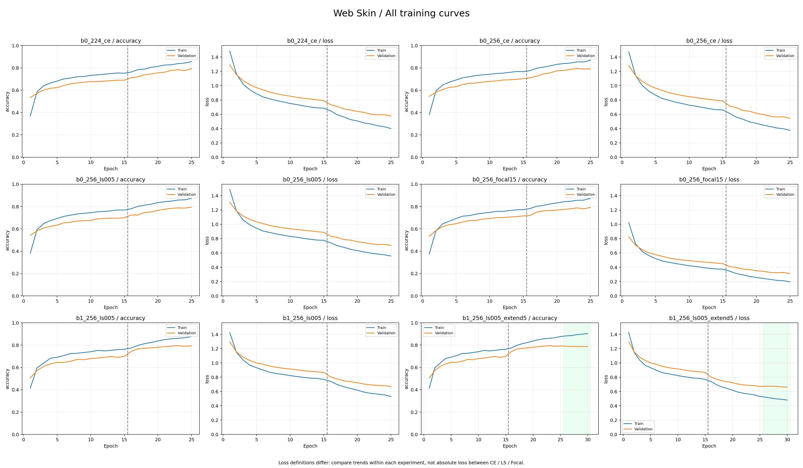

# Web Skin 연구·실험·후보 패키징 총정리

기준일: 2026-09-08. 발표와 보고서에 사용할 현재 상태의 종합 기록이다. 수치는 원본 JSON/CSV의 정밀도를 보존한다. 재학습이나 새로운 성능 측정을 수행한 문서는 아니다.

함께 읽을 문서: [실험의 원리·목적·효과](HAIR_WEB_SKIN_EXPERIMENT_EXPLAINED_20260908.md), [두 모델의 후속 개선 방향](HAIR_WEB_SKIN_IMPROVEMENT_PLAN_20260908.md).

## 1. 무엇을 만드는 모델인가

Web Skin은 웹캠 등으로 촬영한 얼굴 정면 이미지를 대상으로 하는 5종 분류 모델이다. USB 현미경 피부 확대용 Skin, 두피 확대용 Hair와 데이터·클래스·역할을 구분한다.

원천 출처는 AI Hub [안면부 피부질환 이미지 합성 데이터](https://www.aihub.or.kr/aihubdata/data/view.do?currMenu=115&topMenu=100&dataSetSn=71863)
(데이터셋 71863)이다. 사이트는 건선·아토피·여드름·주사·지루·정상의 정면과 측면을 각 1,000장씩,
총 12,000장 제공한다. MediFlow는 지루를 제외하고 정면 5종만 선택했으므로 사이트 원천 기준으로는 5,000장이다.
프로젝트 초기 분할에는 각 클래스 900장씩 총 4,500장을 사용했다.

| 출력 번호 | 클래스 |
|---:|---|
| 0 | 건선 |
| 1 | 아토피 |
| 2 | 여드름 |
| 3 | 정상 |
| 4 | 주사 |

이 순서는 결과 JSON과 모델 출력 배열의 연결 순서다. 설명을 편하게 하려고 순서를 다시 정렬하면
실제 출력 해석이 잘못될 수 있다. 범위 밖 사진을 자동으로 거부하는 기능은 없다.

## 2. 기존 결과와 개선을 시작한 이유

기존에는 ImageNet에서 일반 이미지 특징을 배운 EfficientNet-B0를 고정하고 마지막 분류부만 224×224 입력으로 15 Epoch 학습했다. Epoch는 학습 데이터 전체를 한 번 사용하는 단위다.

| 과거 모델 | Validation Accuracy | Test Accuracy | Test Macro F1 |
|---|---:|---:|---:|
| Original | 0.6679999828338623 | 0.7850000262260437 | 0.7833125866587888 |
| Augmented | 0.6880000233650208 | 0.8199999928474426 | 0.8195818185502844 |

출처: [Original 결과](../../results/web_skin/original/results.json), [Augmented 결과](../../results/web_skin/augmented/results.json). 이 표는 과거 보고값이며 이번에 기존 모델을 다시 측정한 결과가 아니다.

정상에 비해 아토피·여드름의 성능이 낮았다. 개선 원인 후보는 일반 이미지 특징이 피부에 충분히 맞춰지지 않았다는 점, 작은 특징의 축소, 클래스 간 시각적 유사성, 라벨·출처·촬영 조건 차이였다. 원인이 하나라고 확정하고 모델만 크게 바꾸기보다 데이터 확인과 단계별 실험을 먼저 진행했다.

## 3. 데이터 검사와 Hair와의 차이

Hair에서는 Train/Validation/Test 사이 완전 동일 이미지가 발견되어 Clean 데이터셋을 새로 만들었다. Web Skin에서는 기존 감사 결과상 같은 문제가 발견되지 않았으므로 기존 분할과 증강본을 유지했다. 두 모델에 같은 절차를 무조건 반복한 것이 아니라 검사 결과에 따라 결정했다.

| 확인 항목 | Web Skin의 기존 감사 결과 |
|---|---|
| 읽을 수 없는 이미지 | 발견되지 않음 |
| 동일 분할 내 완전 동일 이미지 | 발견되지 않음 |
| Train/Validation/Test 간 파일·RGB 픽셀 중복 | 발견되지 않음 |
| 동일 내용의 클래스 라벨 충돌 | 발견되지 않음 |
| Original과 Augmented의 Validation/Test | 내용·라벨·수량 일치 |
| 사람·병변·촬영 세션별 겹침 | 연결 정보가 없어 미검증 |
| 변형된 유사 사진·증강본의 원본 연결 | 완전한 검증 불가 |

동일 파일 중복 검사 통과는 모든 종류의 데이터 누수가 없다는 뜻이 아니다. 이번 학습에서는 완료된 검사를 반복하지 않고, 입력 ZIP이 검사한 ZIP과 같은지만 SHA-256으로 확인했다.

검사 기록은 `dataset_audit_20260907_174038_67c0377d.zip`에 근거한 이전 확인 결과다. 감사 원본 ZIP을 이번 문서 작성에서 다시 분석하지는 않았다. 현재 학습·패키징 결과에 동일 데이터 식별값이 기록되어 있다.

## 4. 실제 학습 데이터

| 구성 | Train | Validation | Test |
|---|---:|---:|---:|
| Original 전체 | 3600 | 500 | 400 |
| 클래스당 Original | 720 | 100 | 80 |
| 학습에 사용한 Augmented 전체 | 7200 | 500 | 400 |
| 클래스당 Augmented | 1440 | 100 | 80 |

Train 7200장은 원본 3600장과 추가 증강본 3600장을 합한 것이다. Validation과 Test는 원본이다. 따라서 ‘증강본만으로 학습했다’거나 ‘증강본으로 성능을 평가했다’고 설명하면 정확하지 않다.

데이터 위치: `MyDrive/자율설계2/web_skin_processed.zip`.

데이터 SHA-256: `f8908af3d54e521ad14c37a44b569d33fe92be3b8b9b66a8d80faf4ba964072d`.

학습 중 새로운 증강 종류나 강도를 실험하지 않았다. 기존 증강을 고정하고 모델의 학습 방법을 비교했다. 클래스당 수가 같아 클래스 가중치는 별도로 적용하지 않았다.

## 5. 실제 진행 순서

| 순서 | 수행 내용 | 완료 여부 |
|---:|---|---|
| 1 | 기존 Web Skin 결과·클래스 확인 | 완료 |
| 2 | 데이터 감사와 분할 사용 가능 여부 확인 | 기존 감사 완료 |
| 3 | 검사한 ZIP 동일성 확인 | 학습 실행에서 완료 |
| 4 | B0 224의 2단계 학습 기준선 | 완료 |
| 5 | B0 256 해상도 비교 | 완료 |
| 6 | Label Smoothing 및 Focal Loss 비교 | 완료 |
| 7 | B1 모델 구조 비교 | 완료 |
| 8 | B1 미세조정 5 Epoch 추가 | 완료, 이전 최고 유지 |
| 9 | Validation으로 후보 고정 후 후보만 Test 평가 | 완료 |
| 10 | 전체 학습곡선·성능표·혼동행렬·오답 사진 생성 | 완료 |
| 11 | reports ZIP 분석과 지표 재계산 | 완료 |
| 12 | 후보 모델·설명·평가 자료 패키징 | 완료 |
| 13 | 후보 ZIP 로컬 보관, 실제 모델 로드·입출력 검증 | 완료 |
| 14 | 실제 웹캠 독립 평가와 시스템 모델 교체 | 미완료 |

초기 재학습 계획에는 기존 저장 모델을 이어 학습하는 방식이 있었다. 실제 완료된 자동 실험에서는 비교 조건을 통일하기 위해 실험 1~5 모두 ImageNet 가중치에서 새로 시작했다. Hair의 Clean 실험과 같은 2단계 방식이다. 오래된 계획 문서의 ‘실행 전’ 상태와 현재 완료 상태를 구분한다.

## 6. 공통 설정과 실험 변수

| 공통 설정 | 값 |
|---|---|
| 분할·클래스 | 동일 데이터 ZIP과 동일 순서 |
| Seed / Batch | 42 / 32 |
| 입력 | RGB float32 0~255, bilinear resize, 외부 /255 없음 |
| 분류부 | GlobalAveragePooling → Dropout 0.3 → 5개 softmax |
| Stage 1 | 특징 추출부 고정, 15 Epoch, Adam 학습률 1e-4 |
| Stage 2 | 후반부 30개 계층 중 BN 제외, 10 Epoch, 새 Adam 학습률 1e-5 |
| 체크포인트 | Validation Accuracy 최고, 동점이면 먼저 저장한 모델 |
| 최종 후보 | Validation Accuracy 최고, 실험 간 동점이면 앞선 실험 |

BN은 Batch Normalization이다. 미세조정에서도 통계를 고정해 기존 특징이 급격히 바뀌는 위험을 줄이는 설정이다. 입력의 /255 정규화와는 다른 기능이다.

| 실험 | 비교 기준 | 주로 바꾼 조건 |
|---|---|---|
| B0 224 CE | 새 기준선 | 동일 데이터에서 2단계 학습 구성 |
| B0 256 CE | B0 224 CE | 입력 해상도 |
| B0 256 LS 0.05 | B0 256 CE | Loss |
| B0 256 Focal 1.5 | B0 256 CE | Loss (alpha 1.0) |
| B1 256 LS 0.05 | B0 256 LS 0.05 | Backbone |
| B1 추가 5 Epoch | B1 256 LS 0.05 | Stage 2 학습량 |

Stage 1→2는 계층 해제뿐 아니라 낮은 학습률·추가 학습량이 함께 바뀐다. 따라서 모든 상승을 계층 해제 하나의 효과라고 분리해 주장하지 않는다. 새 학습 총량은 5×25+5=130 Epoch다.

## 7. 전체 결과

| 실험 | Validation 정답 | Accuracy | Macro F1 | 보존된 모델 |
|---|---:|---:|---:|---|
| B0 224 CE | 397/500 | 0.794 | 0.7917009497301795 | Stage 2 최고 |
| B0 256 CE | 398/500 | 0.796 | 0.7915394647566528 | Stage 2 최고, 최종 후보 |
| B0 256 LS 0.05 | 397/500 | 0.794 | 0.7892883497449976 | Stage 2 최고 |
| B0 256 Focal 1.5 | 396/500 | 0.792 | 0.7898148816790076 | Stage 2 최고 |
| B1 256 LS 0.05 | 398/500 | 0.796 | 0.7931535064807589 | Stage 2 최고 |
| B1 추가 5 Epoch | 398/500 | 0.796 | 0.7931535064807589 | 연장 전 부모 최고 |

출처: [실험 비교 CSV](../../results/web_skin/experiments/suite_20260908_014452_72768a42/experiment_comparison.csv), [전체 Validation 결과](../../results/web_skin/experiments/suite_20260908_014452_72768a42/all_validation_results.json).

미세조정은 모든 기본 실험에서 Stage 1보다 높은 최고 Validation 정확도를 보였다. 이후 해상도·Loss·Backbone 차이는 정답 1~2장 수준이다. 단일 Seed 실험의 작은 차이를 확정적인 우열로 설명하지 않는다.

B1의 Macro F1은 B0 CE보다 조금 높지만 선정 규칙은 Accuracy였다. Test를 본 뒤 기준을 바꾸지 않고, 동점이면 앞선 실험을 유지한다는 사전 규칙에 따라 B0 CE를 선정했다. ‘B0가 모든 지표에서 우수하다’는 결론은 아니다.

## 8. 학습곡선과 추가 학습의 의미

선정 B0 256의 Stage 1 최고 Validation Accuracy는 0.7039999961853027, Stage 2 최고는 0.7960000038146973이다. 최고 체크포인트는 Stage 2 8번째 Epoch이며 마지막 10번째 모델을 무조건 쓰지 않았다.

B1 연장 구간 자체의 최고 Validation Accuracy는 0.7900000214576721로 부모 최고를 넘지 못했다. 마지막 Train Accuracy는 0.9031944274902344, Validation Accuracy는 0.7860000133514404다. Train만 계속 좋아지고 Validation 정확도는 정체되는 경향이 있어 추가 학습을 채택하지 않았다.

다만 Validation Loss는 감소했다. ‘Loss까지 발산하는 심한 과적합’으로 단정하지 않고, 추가 학습의 정확도 이득이 없고 학습·검증 격차가 커지는 징후라고 해석한다. 연장 결과표의 0.796은 연장 모델 자체의 점수가 아니라 부모 최고 모델을 유지한 값이다.

## 9. 최종 후보의 Test 결과와 오답

최종 후보만 Test를 평가했다. 결과는 400장 중 353장 정답, Accuracy 0.8825 (88.25%), Macro F1 0.8813822927981046이다.

| 클래스 | 정답/80 | Recall | F1 |
|---|---:|---:|---:|
| 건선 | 68/80 | 0.85 | 0.8395061728395061 |
| 아토피 | 63/80 | 0.7875 | 0.8456375838926175 |
| 여드름 | 66/80 | 0.825 | 0.8407643312101911 |
| 정상 | 80/80 | 1.0 | 0.9815950920245399 |
| 주사 | 76/80 | 0.95 | 0.8994082840236686 |

Test의 가장 많은 단방향 혼동은 아토피→건선 9장이다. 정상 80장을 모두 맞혔지만 질환 사진 3장을 정상으로 예측했으므로 정상 출력이 항상 맞는 것은 아니다.

후속 모델 개선의 우선 근거는 Validation이다. 선정 모델의 Validation에서는 여드름→건선 22장, 아토피→건선 18장, 여드름→아토피 14장이 있었다. 이 클래스들의 라벨·사진 품질·주목 영역을 우선 검토할 수 있다.

Validation 0.796보다 Test 0.8825가 높다는 사실만으로 누수나 특정 난도 차이를 확정할 수 없다. 분할에 포함된 개별 사진의 출처와 촬영 조건을 별도로 확인해야 한다.

## 10. 패키징과 검증까지 완료한 내용

후보 ZIP: [public_candidate_v1_b0_256_ce_20260908_081603_3f1ce76e.zip](../../results/web_skin/candidates/public_candidate_v1_b0_256_ce_20260908_081603_3f1ce76e.zip).

- 모델 1개, 클래스 순서, 전처리 규칙, 모델 카드, 평가 결과, 예측 CSV, 비교 그래프, 파일 해시를 포함한다.
- reports 분석: 예측 3400행의 지표 재계산 및 보고서 47개 해시 일치.
- 후보 ZIP 확인: CRC 통과, manifest 대상 34개 파일 해시 및 원본 보고서 27개 일치.
- 실제 선정 모델 로드·가상 입력 실행·256×256×3 입력·5개 출력·내부 Rescaling 확인.
- 모델 SHA-256: `d4c834a7fd47480c1c45ddbdc09257942b38b2408d5b28effc34ee68c4fad97b`.
- 실제 모델 가중치는 검증했지만, 패키징 단계에서 Test를 다시 평가한 것은 아니다.

Drive 보관 위치: `MyDrive/mediflow_models/web_skin/`. 로컬 보관 위치: `results/web_skin/candidates/`.

## 11. 발표에서 사용할 설명

> Web Skin에서는 기존 데이터 검사를 통과한 분할을 유지하고, ImageNet 기반 EfficientNet에 부분 미세조정을 적용했다. 이후 해상도, Loss, Backbone, 추가 학습량을 단계적으로 비교했다. 미세조정 뒤 Validation 성능은 높아졌지만 나머지 설정의 차이는 작았으며, 더 큰 모델이나 추가 학습이 항상 유리하지는 않았다. 사전 기준에 따라 B0·256·CE를 후보로 선정했고, 선정 후 Test에서 400장 중 353장을 맞혔다. 모델과 평가 자료는 검증 가능한 패키지로 보관했으며 실제 웹캠 성능 검증은 별도 과제로 남겼다.

보고서의 권장 전개는 목적 → 기존 한계 → 데이터 감사 → 실험 설계 → 비교 그래프 → 선정 근거 → 오답 분석 → 패키징 → 한계와 후속 연구 순서다.

## 12. 현재 성과와 남은 범위

완료한 것은 공개 데이터에서의 실험 비교, 후보 선정, 자료 시각화, 패키징과 로컬 검증이다. 원래 모델을 다시 평가해 과거 결과를 완전히 재현한 작업, 실제 웹캠 독립 검증, 사람·세션 단위 누수 검증, 범위 밖 입력 거부, 시스템 모델 교체는 완료하지 않았다.

과거 Test 보고값보다 새 Test 기록은 높다. 그러나 과거 학습 당시의 데이터 해시가 없으므로 완전히 동일한 평가 조건에서 재현한 향상이라고 단정하지 않는다. 상세 근거는 [결과 분석](../archive/analysis/WEB_SKIN_EXPERIMENT_RESULTS_20260908.md)과 [후보 검증 완료 기록](../archive/verification/WEB_SKIN_CANDIDATE_VERIFIED_20260908.md)에 보존되어 있다.
